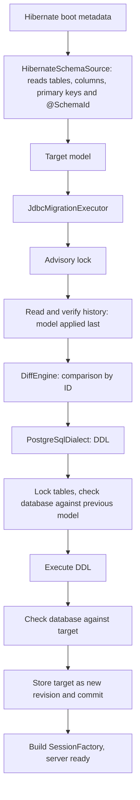

# Architecture

The framework derives the desired database schema from the Hibernate metadata and migrates
the database itself at server startup, before Hibernate builds the SessionFactory. It
detects renames through stable IDs written directly in the entities.

## Server startup flow



Everything between lock and commit runs in one transaction on one connection. Any error
aborts the server startup; Hibernate builds the SessionFactory only after a successful
migration. `hibernate.hbm2ddl.auto` must not be `update` for the managed tables.

## Stable identity with `@SchemaId`

```scala
@Entity
@SchemaId("7f3a9c21")
@Table(name = "customer")
class Customer:
  @Id @SchemaId("0a1b2c3d") var id: java.lang.Long = uninitialized
  @SchemaId("f34e45b6") @Column(name = "nick_name") var nickName: String = uninitialized
  @SchemaId("3e4f5a6b") @Embedded var billing: Address = uninitialized
```

- An ID consists of eight lowercase hex digits. It is generated randomly once and then
  never changed, never derived from a name and never reused. Because it means nothing,
  nobody is tempted to change it along with a rename.
- Entity IDs are unique across all entities, property IDs within their entity. Fields of a
  `@MappedSuperclass` are therefore annotated once and apply in every table.
- The model's IDs are built from them: table `7f3a9c21`, column `7f3a9c21/f34e45b6`,
  embedded column `7f3a9c21/3e4f5a6b/5a6b7c8d`. Two uses of the same embeddable class thus
  get separate IDs.
- The primary key refers to column IDs and survives renames.
- If an ID is missing or has the wrong format, the adapter reports an error with a freshly
  generated suggestion, e.g. `add e.g. @SchemaId("9c1d07aa")`.

Without IDs, "`middleName` dropped, `nickName` added" and "`middleName` renamed" would be
indistinguishable in the code. The ID carries exactly this information. The json-mapper's
`EntitySchema` plays no part in it.

The adapter reads physical names after Hibernate's naming strategies. It folds unquoted
names the way the configured dialect does (PostgreSQL: lower case); tables without their own
schema get `hibernate.default_schema`. The model then contains exact names, which the
renderer always quotes.

## History and previous model

The server passes only the target model: `migrate(dataSource, target)`. The executor reads
the previous model from `__hibernate_ddl.schema_history`. Every migration writes one row
there:

| Column | Contents |
| --- | --- |
| `revision` | 1, 2, 3, … without gaps; assigned by the executor |
| `previous_fingerprint`, `target_fingerprint` | SHA-256 of the previous and the target model |
| `model` | Target model as JSON (`jsonb`), format version 1 |
| `statements` | Executed DDL |
| `applied_at` | Time of application |

- Without history the previous model is the empty model (revision 0). The first start
  creates all tables.
- Because the IDs are stable across all versions, a server that skipped releases plans all
  changes at once against the model stored last.
- If the target equals the stored model (order does not matter), the executor only checks
  the database and writes nothing.
- An older server after a newer migration would rename things back. Therefore a target
  model equal to an earlier revision blocks the startup, and so does a rename back to a name
  the same ID had in an earlier revision. Tables and columns missing from an older model are
  drops, which are not allowed anyway.
- Before any planning the executor checks the whole chain: revisions without gaps, every
  previous fingerprint equal to the target fingerprint of the row before, every stored
  model readable and matching its fingerprint. A modified history blocks the startup.
- The JSON format is versioned and read strictly: another format version, unknown fields
  or unknown types are errors. A history table with other columns comes from another
  version and is refused, never altered.

## Modules

| Module | Contents |
| --- | --- |
| `schema-core` | Model, validation, `DiffEngine`, operations; no dependency on Hibernate or JDBC drivers |
| `schema-hibernate` | `@SchemaId` and `HibernateSchemaSource` (boot metadata → model), pinned to Hibernate 7.4.10 |
| `schema-executor` | Transaction, planning against the stored model, fingerprints, JSON format and history verification, failure states |
| `schema-postgresql` | SQL renderer, catalog checks, locking and history for PostgreSQL 14+ |
| `schema-cli` | Demo without a database connection |

## Current scope

Everything outside this scope is rejected, never silently ignored.

| Area | Supported | Reported and rejected |
| --- | --- | --- |
| Model | Tables, columns `varchar(n)`, `integer`, `bigint`, `boolean`, `text`, nullability, primary keys | All other types and objects |
| Adapter | Entities without inheritance or secondary tables, simple properties, embeddables | Associations/foreign keys, collection and join tables, unique keys, indexes, checks, defaults, identity columns, sequences, columns without an ID origin |
| Diff | New tables, new nullable columns, table and column renames | Drops, type/nullability/primary key changes, schema moves, rename collisions and swaps |
| History | Stored model per revision, skipped releases | Target model of an earlier revision, rename back to an earlier name, modified history, tables without history (no adoption of existing databases) |
| PostgreSQL | Ordinary permanent tables with exactly these columns and a non-deferrable primary key | Other constraints and indexes, triggers, rules, RLS, inheritance, partitions, custom collations |

Tables that exist only in the database are left untouched.

## Open points

1. **Model coverage for real entities.** A typical entity with a `UUID` ID,
   `LocalDateTime` timestamps, `@ManyToOne` and a unique constraint cannot be mapped yet.
   Order: types `uuid` and `timestamp`, then foreign keys, then unique constraints. New
   types also need a name in the history's JSON format.
2. **Adopting existing databases.** Without history the previous model is the empty model;
   tables that already exist (for example from `hbm2ddl`) make `CREATE TABLE` fail.
   Proposal: if a database without history already matches the target model, the executor
   records it as revision 1 without DDL.
3. **Server integration.** The entry point is between `MetadataBuilder.build()` and
   `getSessionFactoryBuilder.build()`. The executor needs a DataSource without JTA
   enlistment. `hibernate.hbm2ddl.auto=validate` works as an independent cross-check after
   the migration.
4. **Drops and intentional renames back** block the startup today. They will need explicit
   approval later.
5. **Retired IDs** can be read from the stored models in the history once drops are
   possible. An ID copied from the Git history can then be rejected instead of being reused
   by accident.

Possible later: data migrations and backfills, multi-phase deployments (expand/contract),
further dialects and an export to Flyway or Liquibase as an alternative mode of operation.
