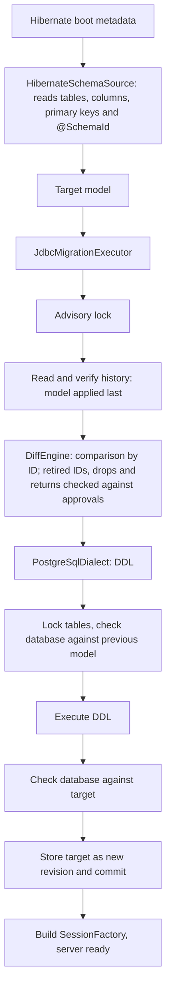

# Architecture

The framework derives the desired database schema from the Hibernate metadata and migrates
the database itself at server startup, before Hibernate builds the SessionFactory. It
detects renames through stable IDs written directly in the entities.

## Server startup flow



Everything between lock and commit runs in one transaction on one connection. Any error
aborts the server startup; Hibernate builds the SessionFactory only after a successful
migration. Before DDL, and for adoption or a manual migration, the modeled tables are
locked exclusively. A start whose target is already applied only checks the database and
locks the tables in `ACCESS SHARE` mode, which keeps schema changes out but lets a running
application read and write.

The executor switches the connection to `READ COMMITTED` without auto-commit. Once the
transaction has ended with a known outcome, it gives the connection back the auto-commit
mode and isolation level it arrived with, so that a pool never hands it on changed. If that
fails, it aborts the connection and reports the failure, after a commit as
`FailureState.Committed`: the schema is migrated, but the server does not start silently.

`HibernateSchemaMigration.migrate(metadata, dataSource, options)` runs this flow between
`buildMetadata()` and `buildSessionFactory()`. With `hibernate.ddl_manager.enabled=true`
the `SchemaMigrationIntegrator`, registered through `META-INF/services`, does the same while
Hibernate builds the SessionFactory: integrators run before Hibernate's schema management,
so `hibernate.hbm2ddl.auto=validate` becomes an independent check of the migrated schema.
It borrows one connection from Hibernate's ConnectionProvider, rolls back and enables
auto-commit on it if needed, and restores it before giving it back. It refuses JTA and
multi-tenancy, where the server must call the explicit API with a suitable DataSource.
Both paths refuse a non-PostgreSQL dialect and any Hibernate schema action other than
`none` or `validate`, because Hibernate must not change the managed schema itself.
`hibernate.ddl_manager.*` settings map onto the execution options; unknown ones are errors.

## Stable identity with `@SchemaId`

```scala
@Entity
@SchemaId("7f3a9c21")
@Table(name = "customer")
class Customer:
  @Id @SchemaId("0a1b2c3d") var id: java.lang.Long = uninitialized
  @SchemaId("f34e45b6") @Column(name = "nick_name") var nickName: String = uninitialized
  @SchemaId("3e4f5a6b") @Embedded var billing: Address = uninitialized
```

- An ID consists of eight lowercase hex digits. It is generated randomly once and then
  never changed, never derived from a name and never reused. Because it means nothing,
  nobody is tempted to change it along with a rename.
- Entity IDs are unique across all entities, property IDs within their entity. Fields of a
  `@MappedSuperclass` are therefore annotated once and apply in every table.
- The model's IDs are built from them: table `7f3a9c21`, column `7f3a9c21/f34e45b6`,
  embedded column `7f3a9c21/3e4f5a6b/5a6b7c8d`. Two uses of the same embeddable class thus
  get separate IDs.
- The primary key refers to column IDs and survives renames.
- A secondary table cannot carry `@SchemaId`, so the entity names its ID with
  `@SecondaryTableId(table = "customer_details", value = "5d6e7f80")`: the table becomes
  `entity/5d6e7f80`, its key column `entity/5d6e7f80/key`. Its properties keep
  `entity/property`. When renaming the table, change `table` along with
  `@SecondaryTable(name)` and keep `value`.
- An association's join column takes the association property's ID. Its foreign key refers
  to the referenced table's ID and primary-key column IDs, so renames on either side keep
  it intact. Constraint names are not part of the model; PostgreSQL chooses them.
- A unique key lists column IDs in key order and likewise survives renames; so does an
  index, which also records each column's direction.
- A column's ID starts with the ID of the entity that declares the property. With inheritance
  a single-table hierarchy shares its root's table (subclass columns `subclass/property`,
  the discriminator `root/discriminator`); a joined subclass has its own table whose key
  column is `subclass/key`; a table-per-class subclass repeats every inherited column as
  `subclass/property`. Moving a property to another class of the hierarchy changes its ID.
- A collection table (`@ElementCollection` or a `@ManyToMany` join table) takes the ID
  `entity/property` of its owning property. Its owner key column is `entity/property/key`, a
  basic or entity element `entity/property/element`, and an embeddable element's columns
  `entity/property/embedded-property`. A list's order column or a map's key column is
  `entity/property/index`, an embeddable map key's columns
  `entity/property/index/embedded-property`.
- An embeddable stored as one JSON document (`@Embedded @JdbcTypeCode(SqlTypes.JSON)`) is a
  single column with the embedded property's ID. Its properties live inside the document
  and need no IDs; renaming one changes the data, not the schema, and stays with the
  application.
- A key sequence (from `@GeneratedValue` with a sequence) takes its key column's ID plus
  `/sequence`, so renaming it with `@SequenceGenerator(sequenceName)` is a rename that keeps
  its current value. Each sequence must generate the key of exactly one entity. Identity
  columns (`GenerationType.IDENTITY`) are a column property.
- An enum column carries its CHECK constraint as allowed values or an ordinal range. On
  PostgreSQL the constraint is named after a hash of the column ID and the check, so a
  rename keeps the name and a changed check gets a new one. The name alone proves nothing:
  the constraint must also have exactly the definition the framework creates. PostgreSQL
  rewrites check expressions, so the backend creates the expected checks on a temporary
  probe table in the same transaction and compares both as `pg_get_constraintdef` shows
  them. This needs the `TEMPORARY` privilege on the database, which PostgreSQL grants to
  everyone by default.
- If an ID is missing or has the wrong format, the adapter reports an error with a freshly
  generated suggestion, e.g. `add e.g. @SchemaId("9c1d07aa")`.

Without IDs, "`middleName` dropped, `nickName` added" and "`middleName` renamed" would be
indistinguishable in the code. The ID carries exactly this information. The json-mapper's
`EntitySchema` plays no part in it.

The adapter reads physical names after Hibernate's naming strategies. It folds unquoted
names the way the configured dialect does (PostgreSQL: lower case); tables without their own
schema get `hibernate.default_schema`. The model then contains exact names, which the
renderer always quotes.

## History and previous model

The server passes only the target model: `migrate(dataSource, target)`. The executor reads
the previous model from `__hibernate_ddl.schema_history`. Every migration writes one row
there:

| Column | Contents |
| --- | --- |
| `revision` | 1, 2, 3, … without gaps; assigned by the executor |
| `previous_fingerprint`, `target_fingerprint` | SHA-256 of the previous and the target model |
| `model` | Target model as JSON (`jsonb`), format version 6 |
| `statements` | Executed DDL |
| `applied_at` | Time of application |

- Without history the previous model is the empty model (revision 0). The first start
  creates all tables.
- A database without history that already contains a table or sequence of the target is
  refused, unless `ExecutionOptions.adoptExistingSchema` is set. Then every table and
  sequence of the target must exist, and the database must match the target exactly under
  the lock; the executor records it as revision 1 with no statements and returns
  `Adopted`. Nothing is created, changed or renamed. Hibernate names enum checks
  `table_column_check`, the framework after a hash of the column ID; such checks show up as
  drift and must be renamed by hand before adoption. Enum and discriminator checks then
  match; an `@OrderColumn`'s `position >= 0` does not, because the framework checks the
  range up to the type's maximum, and must be replaced by hand.
- Because the IDs are stable across all versions, a server that skipped releases plans all
  changes at once against the model stored last.
- If the target equals the stored model (order does not matter), the executor only checks
  the database and writes nothing.
- An older server after a newer migration would rename things back and drop what the newer
  model added. Therefore a target model equal to an earlier revision blocks the startup, and
  so does a rename back to a name the same ID had in an earlier revision. An intended return
  needs an explicit approval in the options: `Approval.Revert(revision)` for a target equal
  to that revision, `Approval.RenameBack(id)` for each rename back.
- Dropping a table, column or sequence deletes data and needs `Approval.Drop(id)` for each
  stable ID. A dropped table takes its columns, keys and indexes with it; a dropped column
  takes the checks, keys and indexes over it. An entity's collection tables and sequence
  are objects of their own and need their own approvals. The refusal lists every missing
  approval; an approval whose change is not planned has no effect.
- A change the executor cannot plan is refused together with the target's fingerprint. An
  operator can migrate the database by hand and start once with
  `ExecutionOptions.acceptManualMigration` set to that fingerprint: the executor checks the
  database against the target exactly, checks that no table or sequence of the previous
  model remains under a name the target no longer has, and records the target as the next
  revision with no statements. An option naming another target is refused. Earlier-revision, retired-ID and
  drift checks still apply.
- A column that becomes required (a new required column in an existing table is added
  nullable first) gets `SET NOT NULL` after the foreign keys and before the drops. Right
  before it, the one registered backfill that targets the column and is not recorded yet
  fills its NULLs, and a count under the lock must find none left. Several such backfills
  for one column, a backfill reading a column that another fills, and a value that does not
  fit are refused before any change. See [backfills](backfills-and-not-null.md).
- `__hibernate_ddl.backfill_history` records each backfill once, with the format and
  checksum of its definition, the target column ID, the schema revision and fingerprints of
  the migration that recorded it, and whether it was executed (with the updated rows), not
  required because a new table created the column, or adopted because adoption or a manual
  migration found the column required. Before anything else, even when the schema is
  already applied, every record must match the schema history and every registered backfill
  its record; a changed definition needs a new ID. A backfill whose column does not become
  required stays pending and is reported in `MigrationResult.pendingBackfills`. The schema
  history, its models and fingerprints do not change; the backfill history references its
  revisions.
- A dropped ID is retired: an ID that an earlier revision had and the latest does not may
  never appear again, not even with approvals. This rejects an ID copied from the version
  history of the code, which would attach the dropped object's identity to a new one.
- Before any planning the executor checks the whole chain: revisions without gaps, every
  previous fingerprint equal to the target fingerprint of the row before, every stored
  model readable and matching its fingerprint. A modified history blocks the startup.
- The JSON format is versioned and read strictly: an unknown format version, unknown fields
  or unknown types are errors. Format 2 added foreign keys, format 3 unique keys, format 4
  indexes, format 5 column checks and format 6 identity columns and sequences; models stored
  in earlier formats are still read and keep their fingerprints. A history table with
  other columns comes from another version and is refused, never altered.

## Modules

| Module | Contents |
| --- | --- |
| `schema-core` | Model, validation, `DiffEngine`, operations; no dependency on Hibernate or JDBC drivers |
| `schema-hibernate` | `@SchemaId` and `HibernateSchemaSource` (boot metadata → model), pinned to Hibernate 7.4.10 |
| `schema-executor` | Transaction, planning against the stored model, fingerprints, JSON format and history verification, failure states |
| `schema-postgresql` | SQL renderer, catalog checks, locking and history for PostgreSQL 14+ |
| `schema-integration` | `HibernateSchemaMigration`, the opt-in `SchemaMigrationIntegrator` and the `hibernate.ddl_manager.*` settings |
| `schema-cli` | Demo without a database connection |

## Scope of 1.0

Everything outside this scope is rejected, never silently ignored.

| Area | Supported | Reported and rejected |
| --- | --- | --- |
| Model | Tables, columns `varchar(n)`, `char(n)`, `text`, `smallint`, `integer`, `bigint`, `numeric(p,s)`, `real`, `double precision`, `boolean`, `uuid`, `date`, `time(p)`, `timestamp(p)`, `timestamp(p) with time zone`, binary data (`bytea`), large objects (`oid`), JSON documents (`jsonb`), nullability, identity columns, column checks (allowed values, integer range), ascending bigint sequences, primary keys, unique keys, plain indexes with column directions, foreign keys to a primary key | All other types and objects |
| Adapter | Entities, secondary tables with `@SecondaryTableId`, inheritance by `SINGLE_TABLE` (with its discriminator check), `JOINED` or `TABLE_PER_CLASS` (also with an abstract root and one sequence for the hierarchy), `@MappedSuperclass`, simple properties, embeddables, generated `UUID` keys, `@GeneratedValue` by sequence (Hibernate's default `Entity_SEQ` or `@SequenceGenerator`) or identity, `LocalDate`, `LocalTime`, `LocalDateTime`, `Instant`, `OffsetDateTime` and `@Column(secondPrecision)`, `BigDecimal` and `BigInteger` with `@Column(precision, scale)`, `Short`, `Byte`, `Float`, `Double`, `Character`, `byte[]`, `@Lob`, `Blob` and `Clob` (as large objects), `@JdbcTypeCode(SqlTypes.JSON)` on a basic property or an `@Embedded` embeddable (one `jsonb` column), `Duration` (as `numeric`), `@ManyToOne` with or without a constraint, `@OneToOne`, `@Column(unique)`, `@UniqueConstraint`, `@NaturalId`, `@Index` with `asc`/`desc`, `@Enumerated` by name or ordinal, `@ElementCollection` and `@ManyToMany` (also unidirectional `@OneToMany` through a join table) as sets, lists, `@OrderColumn` lists or maps (basic, embeddable or entity keys) of basic values, enums, embeddables or entities | Other CHECK constraints (`@Column(check)`, `@Check`, enum values containing a quote), enums and non-null properties inside a JSON embeddable (Hibernate guards them with a table check), arrays and other types, `ON DELETE` actions, associations to non-primary-key or multi-column keys, ordered unique keys, DDL `options` of columns, tables, primary and unique keys, foreign keys, indexes and sequences (Hibernate appends them verbatim), index expressions, `@CollectionId` bags, collections inside embeddables or sharing a table, sequences shared by several keys or used by no key, `GenerationType.TABLE`, table-level checks, defaults, columns without an ID origin |
| Diff | New and renamed sequences, new tables, new columns (a required one is added nullable and made required after a NULL count under the lock), columns becoming required or optional, new unique keys and indexes, new foreign keys (added after all tables, so cycles work), added, changed or removed column checks (existing rows are validated), table and column renames; approved drops of columns (with the keys and indexes over them), tables (all in one statement, so they may reference each other) and sequences, run last and without `CASCADE` | Unapproved drops, dropping a key, index or foreign key whose columns remain, reusing a dropped name in the same plan, sequence start or increment changes, identity changes, new identity columns in existing tables, a required column with NULLs left, type/primary key/foreign key changes, schema moves, rename collisions and swaps |
| History | Stored model per revision, skipped releases, opt-in adoption of an existing database that matches the target exactly, approved returns to an earlier revision or name | Unapproved target model of an earlier revision or rename back to an earlier name, modified history, existing tables without history unless adopted, partial adoption |
| PostgreSQL | Ordinary permanent tables with exactly these columns and `GENERATED BY DEFAULT` identity columns whose sequence has PostgreSQL's defaults (start, increment and minimum 1, the type's maximum, cache 1, no cycling), unowned bigint sequences with default minimum, maximum, cache and no cycling, a non-deferrable primary key, plain unique constraints, plain B-tree indexes and plain foreign keys, matched by structure; column checks, matched by their derived name, column and definition | `GENERATED ALWAYS` identity, identity sequences with other options, sequences with other types or options or owned by a column, other constraints, unexpected or `NOT VALID` checks, checks with another definition, unique, partial, expression, covering or non-B-tree indexes, custom operator classes, collations or `NULLS` ordering, deferrable, `INCLUDE` or `NULLS NOT DISTINCT` unique keys, foreign keys with actions, `MATCH FULL` or deferrable checking, foreign keys from unmodeled tables, triggers, rules, RLS, inheritance, partitions, custom collations |

Tables that exist only in the database are left untouched.

Foreign key columns get no index automatically; declare one with `@Index` where deletes on
the referenced table must be fast. An end-to-end test migrates a set of entities covering
the adapter's scope into PostgreSQL, and another adopts a schema that Hibernate's own schema
generation created.

## After 1.0

Until then, each of these is refused, or needs a manual migration (`acceptManualMigration`):

- **Model coverage:** arrays, collections inside embeddables (outside JSON documents),
  `@CollectionId` bags, other CHECK constraints including those on JSON content,
  `ON DELETE` actions. Each new type needs a name in the history's
  JSON format.
- **Removing orphaned large objects** stays with `vacuumlo`; the `lo_manage` trigger would
  need triggers in the model.
- **Dropping a unique key, index or foreign key whose columns remain.** PostgreSQL names
  these objects, so dropping one needs a lookup by structure under the lock.
- **Adopting Hibernate-named checks:** matching a check constraint by its definition alone
  instead of also by its derived name, so that a database created by `hbm2ddl` with enums is
  adopted without
  renaming its checks by hand.
- **Data migrations and backfills** (non-null columns, type changes), multi-phase
  deployments (expand/contract), further dialects and an export to Flyway or Liquibase as an
  alternative mode of operation.
