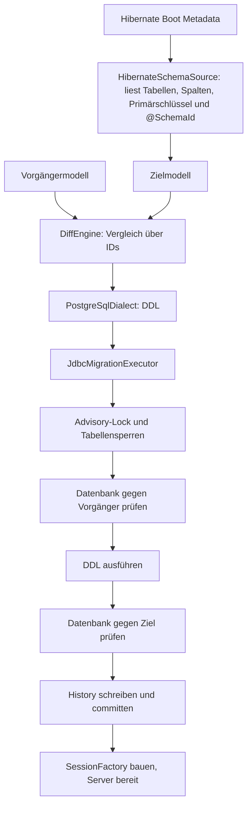

# Architektur

Das Framework leitet das gewünschte Datenbankschema aus den Hibernate-Metadaten ab und
migriert die Datenbank beim Serverstart selbst, bevor Hibernate die SessionFactory aufbaut.
Umbenennungen erkennt es über stabile IDs, die direkt in den Entities stehen.

## Ablauf beim Serverstart



Alles zwischen Lock und Commit läuft in einer Transaktion auf einer Verbindung. Jeder
Fehler bricht den Serverstart ab; Hibernate baut die SessionFactory nur nach einer
erfolgreichen Migration. `hibernate.hbm2ddl.auto` darf für die verwalteten Tabellen nicht
`update` sein.

## Stabile Identität mit `@SchemaId`

```scala
@Entity
@SchemaId("7f3a9c21")
@Table(name = "customer")
class Customer:
  @Id @SchemaId("0a1b2c3d") var id: java.lang.Long = uninitialized
  @SchemaId("f34e45b6") @Column(name = "nick_name") var nickName: String = uninitialized
  @SchemaId("3e4f5a6b") @Embedded var billing: Address = uninitialized
```

- Eine ID besteht aus acht kleinen Hex-Ziffern. Sie wird einmal zufällig erzeugt und danach
  nie geändert, nie aus einem Namen berechnet und nie wiederverwendet. Weil sie nichts
  bedeutet, kommt niemand auf die Idee, sie beim Umbenennen mitzuändern.
- Entity-IDs sind über alle Entities eindeutig, Property-IDs innerhalb ihrer Entity. Felder
  einer `@MappedSuperclass` werden deshalb einmal annotiert und gelten in jeder Tabelle.
- Daraus entstehen die IDs des Modells: Tabelle `7f3a9c21`, Spalte `7f3a9c21/f34e45b6`,
  eingebettete Spalte `7f3a9c21/3e4f5a6b/5a6b7c8d`. Zwei Verwendungen derselben
  Embeddable-Klasse bekommen so getrennte IDs.
- Der Primärschlüssel verweist auf Spalten-IDs und bleibt bei Umbenennungen erhalten.
- Fehlt eine ID oder hat sie das falsche Format, meldet der Adapter einen Fehler mit
  frisch erzeugtem Vorschlag, z. B. `add e.g. @SchemaId("9c1d07aa")`.

Ohne IDs wären „`middleName` gelöscht, `nickName` neu“ und „`middleName` umbenannt“ im Code
nicht unterscheidbar. Die ID trägt genau diese Information. Das `EntitySchema` des
json-mappers ist daran nicht beteiligt.

Physische Namen liest der Adapter nach Hibernates Naming-Strategien. Unquotierte Namen
faltet er wie der konfigurierte Dialekt (PostgreSQL: Kleinbuchstaben); Tabellen ohne
eigenes Schema erhalten `hibernate.default_schema`. Das Modell enthält danach exakte Namen,
die der Renderer immer quotiert.

## Module

| Modul | Inhalt |
| --- | --- |
| `schema-core` | Modell, Validierung, `DiffEngine`, Operationen; ohne Abhängigkeit zu Hibernate oder JDBC-Treibern |
| `schema-hibernate` | `@SchemaId` und `HibernateSchemaSource` (Boot Metadata → Modell), fixiert auf Hibernate 7.4.10 |
| `schema-executor` | Transaktion, Planprüfung, Fingerprints, History-Abgleich, Fehlerzustände |
| `schema-postgresql` | SQL-Renderer, Katalogprüfung, Sperren und History für PostgreSQL 14+ |
| `schema-cli` | Demo ohne Datenbankverbindung |

## Heutiger Umfang

Alles außerhalb dieses Umfangs wird abgelehnt, nie stillschweigend ignoriert.

| Bereich | Unterstützt | Gemeldet und abgelehnt |
| --- | --- | --- |
| Modell | Tabellen, Spalten `varchar(n)`, `integer`, `bigint`, `boolean`, `text`, Nullability, Primärschlüssel | alle anderen Typen und Objekte |
| Adapter | Entities ohne Vererbung und Secondary Tables, einfache Properties, Embeddables | Assoziationen/Fremdschlüssel, Collection- und Join-Tabellen, Unique-Keys, Indizes, Checks, Defaults, Identity-Spalten, Sequenzen, Spalten ohne ID-Herkunft |
| Diff | neue Tabellen, neue nullable Spalten, Tabellen- und Spalten-Renames | Löschungen, Typ-/Nullability-/Primärschlüssel-Änderungen, Schema-Wechsel, Rename-Kollisionen und -Tausch |
| PostgreSQL | gewöhnliche permanente Tabellen mit genau diesen Spalten und nicht-deferrable Primärschlüssel | weitere Constraints und Indizes, Trigger, Rules, RLS, Vererbung, Partitionen, eigene Collations |

Tabellen, die nur in der Datenbank existieren, bleiben unberührt.

## Offene Punkte

1. **Woher kommt das Vorgängermodell?** Der Executor erwartet heute
   `MigrationRequest(id, previous, target)` mit fortlaufenden Revisionen; eine
   Snapshot-Persistenz gibt es nicht. Vorschlag: Das zuletzt angewendete Modell wird in der
   History-Tabelle gespeichert und dient beim nächsten Start als Vorgänger. Weil die IDs über
   alle Versionen stabil sind, funktioniert das auch, wenn ein Server mehrere Releases
   überspringt. Der Aufruf schrumpft dann auf `migrate(dataSource, metadata)`; Migrations-ID,
   Revisionen und eingecheckte Snapshots entfallen.
2. **Modellabdeckung für reale Entities.** Eine typische Entity mit `UUID`-ID,
   `LocalDateTime`-Zeitstempeln, `@ManyToOne` und Unique-Constraint ist noch nicht
   abbildbar. Reihenfolge: Typen `uuid` und `timestamp`, dann Fremdschlüssel, dann
   Unique-Constraints.
3. **Server-Integration.** Einstiegspunkt ist die Stelle zwischen
   `MetadataBuilder.build()` und `getSessionFactoryBuilder.build()`. Der Executor braucht
   eine DataSource ohne JTA-Einbindung. `hibernate.hbm2ddl.auto=validate` eignet sich als
   unabhängige Gegenprüfung nach der Migration.
4. **Löschungen** blockieren heute den Start. Sie brauchen später eine ausdrückliche Freigabe.
5. **Ausgemusterte IDs** könnten in der History vermerkt werden, damit eine aus der
   Git-Historie kopierte ID nicht versehentlich wiederverwendet wird.

Später denkbar: Datenmigrationen und Backfills, mehrphasige Deployments (expand/contract),
weitere Dialekte und ein Export nach Flyway oder Liquibase als alternative Betriebsart.
