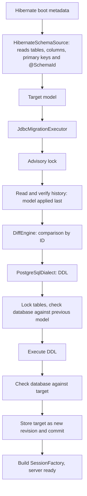

# Architecture

The framework derives the desired database schema from the Hibernate metadata and migrates
the database itself at server startup, before Hibernate builds the SessionFactory. It
detects renames through stable IDs written directly in the entities.

## Server startup flow



Everything between lock and commit runs in one transaction on one connection. Any error
aborts the server startup; Hibernate builds the SessionFactory only after a successful
migration. `hibernate.hbm2ddl.auto` must not be `update` for the managed tables.

## Stable identity with `@SchemaId`

```scala
@Entity
@SchemaId("7f3a9c21")
@Table(name = "customer")
class Customer:
  @Id @SchemaId("0a1b2c3d") var id: java.lang.Long = uninitialized
  @SchemaId("f34e45b6") @Column(name = "nick_name") var nickName: String = uninitialized
  @SchemaId("3e4f5a6b") @Embedded var billing: Address = uninitialized
```

- An ID consists of eight lowercase hex digits. It is generated randomly once and then
  never changed, never derived from a name and never reused. Because it means nothing,
  nobody is tempted to change it along with a rename.
- Entity IDs are unique across all entities, property IDs within their entity. Fields of a
  `@MappedSuperclass` are therefore annotated once and apply in every table.
- The model's IDs are built from them: table `7f3a9c21`, column `7f3a9c21/f34e45b6`,
  embedded column `7f3a9c21/3e4f5a6b/5a6b7c8d`. Two uses of the same embeddable class thus
  get separate IDs.
- The primary key refers to column IDs and survives renames.
- A secondary table cannot carry `@SchemaId`, so the entity names its ID with
  `@SecondaryTableId(table = "customer_details", value = "5d6e7f80")`: the table becomes
  `entity/5d6e7f80`, its key column `entity/5d6e7f80/key`. Its properties keep
  `entity/property`. When renaming the table, change `table` along with
  `@SecondaryTable(name)` and keep `value`.
- An association's join column takes the association property's ID. Its foreign key refers
  to the referenced table's ID and primary-key column IDs, so renames on either side keep
  it intact. Constraint names are not part of the model; PostgreSQL chooses them.
- A unique key lists column IDs in key order and likewise survives renames; so does an
  index, which also records each column's direction.
- A column's ID starts with the ID of the entity that declares the property. With inheritance
  a single-table hierarchy shares its root's table (subclass columns `subclass/property`,
  the discriminator `root/discriminator`); a joined subclass has its own table whose key
  column is `subclass/key`; a table-per-class subclass repeats every inherited column as
  `subclass/property`. Moving a property to another class of the hierarchy changes its ID.
- A collection table (`@ElementCollection` or a `@ManyToMany` join table) takes the ID
  `entity/property` of its owning property. Its owner key column is `entity/property/key`, a
  basic or entity element `entity/property/element`, and an embeddable element's columns
  `entity/property/embedded-property`. A list's order column or a map's key column is
  `entity/property/index`, an embeddable map key's columns
  `entity/property/index/embedded-property`.
- A key sequence (from `@GeneratedValue` with a sequence) takes its key column's ID plus
  `/sequence`, so renaming it with `@SequenceGenerator(sequenceName)` is a rename that keeps
  its current value. Each sequence must generate the key of exactly one entity. Identity
  columns (`GenerationType.IDENTITY`) are a column property.
- An enum column carries its CHECK constraint as allowed values or an ordinal range. On
  PostgreSQL the constraint is named after a hash of the column ID and the check, so a
  rename keeps the name and a changed check gets a new one.
- If an ID is missing or has the wrong format, the adapter reports an error with a freshly
  generated suggestion, e.g. `add e.g. @SchemaId("9c1d07aa")`.

Without IDs, "`middleName` dropped, `nickName` added" and "`middleName` renamed" would be
indistinguishable in the code. The ID carries exactly this information. The json-mapper's
`EntitySchema` plays no part in it.

The adapter reads physical names after Hibernate's naming strategies. It folds unquoted
names the way the configured dialect does (PostgreSQL: lower case); tables without their own
schema get `hibernate.default_schema`. The model then contains exact names, which the
renderer always quotes.

## History and previous model

The server passes only the target model: `migrate(dataSource, target)`. The executor reads
the previous model from `__hibernate_ddl.schema_history`. Every migration writes one row
there:

| Column | Contents |
| --- | --- |
| `revision` | 1, 2, 3, … without gaps; assigned by the executor |
| `previous_fingerprint`, `target_fingerprint` | SHA-256 of the previous and the target model |
| `model` | Target model as JSON (`jsonb`), format version 6 |
| `statements` | Executed DDL |
| `applied_at` | Time of application |

- Without history the previous model is the empty model (revision 0). The first start
  creates all tables.
- Because the IDs are stable across all versions, a server that skipped releases plans all
  changes at once against the model stored last.
- If the target equals the stored model (order does not matter), the executor only checks
  the database and writes nothing.
- An older server after a newer migration would rename things back. Therefore a target
  model equal to an earlier revision blocks the startup, and so does a rename back to a name
  the same ID had in an earlier revision. Tables and columns missing from an older model are
  drops, which are not allowed anyway.
- Before any planning the executor checks the whole chain: revisions without gaps, every
  previous fingerprint equal to the target fingerprint of the row before, every stored
  model readable and matching its fingerprint. A modified history blocks the startup.
- The JSON format is versioned and read strictly: an unknown format version, unknown fields
  or unknown types are errors. Format 2 added foreign keys, format 3 unique keys, format 4
  indexes, format 5 column checks and format 6 identity columns and sequences; models stored
  in earlier formats are still read and keep their fingerprints. A history table with
  other columns comes from another version and is refused, never altered.

## Modules

| Module | Contents |
| --- | --- |
| `schema-core` | Model, validation, `DiffEngine`, operations; no dependency on Hibernate or JDBC drivers |
| `schema-hibernate` | `@SchemaId` and `HibernateSchemaSource` (boot metadata → model), pinned to Hibernate 7.4.10 |
| `schema-executor` | Transaction, planning against the stored model, fingerprints, JSON format and history verification, failure states |
| `schema-postgresql` | SQL renderer, catalog checks, locking and history for PostgreSQL 14+ |
| `schema-cli` | Demo without a database connection |

## Current scope

Everything outside this scope is rejected, never silently ignored.

| Area | Supported | Reported and rejected |
| --- | --- | --- |
| Model | Tables, columns `varchar(n)`, `char(n)`, `text`, `smallint`, `integer`, `bigint`, `numeric(p,s)`, `real`, `double precision`, `boolean`, `uuid`, `date`, `time(p)`, `timestamp(p)`, `timestamp(p) with time zone`, binary data (`bytea`), large objects (`oid`, as Hibernate maps `@Lob`), nullability, identity columns, column checks (allowed values, integer range), ascending bigint sequences, primary keys, unique keys, plain indexes with column directions, foreign keys to a primary key | All other types and objects |
| Adapter | Entities, secondary tables with `@SecondaryTableId`, inheritance by `SINGLE_TABLE` (with its discriminator check), `JOINED` or `TABLE_PER_CLASS` (also with an abstract root and one sequence for the hierarchy), `@MappedSuperclass`, simple properties, embeddables, generated `UUID` keys, `@GeneratedValue` by sequence (Hibernate's default `Entity_SEQ` or `@SequenceGenerator`) or identity, `LocalDate`, `LocalTime`, `LocalDateTime`, `Instant`, `OffsetDateTime` and `@Column(secondPrecision)`, `BigDecimal` and `BigInteger` with `@Column(precision, scale)`, `Short`, `Byte`, `Float`, `Double`, `Character`, `byte[]`, `Duration` (as `numeric`), `@ManyToOne` with or without a constraint, `@OneToOne`, `@Column(unique)`, `@UniqueConstraint`, `@NaturalId`, `@Index` with `asc`/`desc`, `@Enumerated` by name or ordinal, `@ElementCollection` and `@ManyToMany` (also unidirectional `@OneToMany` through a join table) as sets, lists, `@OrderColumn` lists or maps (basic, embeddable or entity keys) of basic values, enums, embeddables or entities | Other CHECK constraints (`@Column(check)`, `@Check`, enum values containing a quote), JSON columns (`jsonb`), `ON DELETE` actions, associations to non-primary-key or multi-column keys, ordered unique keys, index options and expressions, `@CollectionId` bags, collections inside embeddables or sharing a table, sequences shared by several keys or used by no key, `GenerationType.TABLE`, table-level checks, defaults, columns without an ID origin |
| Diff | New and renamed sequences, new tables, new nullable columns, new unique keys and indexes, new foreign keys (added after all tables, so cycles work), added, changed or removed column checks (existing rows are validated), table and column renames | Drops (including keys, indexes and sequences), sequence start or increment changes, identity changes, type/nullability/primary key/foreign key changes, schema moves, rename collisions and swaps |
| History | Stored model per revision, skipped releases | Target model of an earlier revision, rename back to an earlier name, modified history, tables without history (no adoption of existing databases) |
| PostgreSQL | Ordinary permanent tables with exactly these columns and `GENERATED BY DEFAULT` identity columns, unowned bigint sequences with default minimum, maximum, cache and no cycling, a non-deferrable primary key, plain unique constraints, plain B-tree indexes and plain foreign keys, matched by structure; column checks, matched by their derived name and column | `GENERATED ALWAYS` identity, sequences with other types or options or owned by a column, other constraints, unexpected or `NOT VALID` checks, unique, partial, expression, covering or non-B-tree indexes, custom operator classes, collations or `NULLS` ordering, deferrable, `INCLUDE` or `NULLS NOT DISTINCT` unique keys, foreign keys with actions, `MATCH FULL` or deferrable checking, foreign keys from unmodeled tables, triggers, rules, RLS, inheritance, partitions, custom collations |

Tables that exist only in the database are left untouched.

## Open points

1. **Model coverage for real entities.** The common basic types, enums, `UUID` keys,
   associations, collection tables, inheritance, unique constraints, indexes and generated
   keys work, as do secondary tables and `@Lob`; an end-to-end test migrates a set of such
   entities into PostgreSQL. Next: collections inside embeddables and JSON columns. New types
   also need a name in the history's JSON format. PostgreSQL does not delete a large object
   with its row; `@Lob` columns need `vacuumlo` or the `lo` extension's trigger, which stay
   outside this framework. Foreign key columns get no index automatically;
   declare one with `@Index` where deletes on the referenced table must be fast.
2. **Adopting existing databases.** Without history the previous model is the empty model;
   tables that already exist (for example from `hbm2ddl`) make `CREATE TABLE` fail.
   Proposal: if a database without history already matches the target model, the executor
   records it as revision 1 without DDL.
3. **Server integration.** The entry point is between `MetadataBuilder.build()` and
   `getSessionFactoryBuilder.build()`. The executor needs a DataSource without JTA
   enlistment. `hibernate.hbm2ddl.auto=validate` works as an independent cross-check after
   the migration.
4. **Drops and intentional renames back** block the startup today. They will need explicit
   approval later.
5. **Retired IDs** can be read from the stored models in the history once drops are
   possible. An ID copied from the Git history can then be rejected instead of being reused
   by accident.

Possible later: data migrations and backfills, multi-phase deployments (expand/contract),
further dialects and an export to Flyway or Liquibase as an alternative mode of operation.
