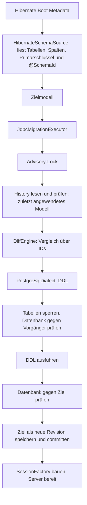

# Architektur

Das Framework leitet das gewünschte Datenbankschema aus den Hibernate-Metadaten ab und
migriert die Datenbank beim Serverstart selbst, bevor Hibernate die SessionFactory aufbaut.
Umbenennungen erkennt es über stabile IDs, die direkt in den Entities stehen.

## Ablauf beim Serverstart



Alles zwischen Lock und Commit läuft in einer Transaktion auf einer Verbindung. Jeder
Fehler bricht den Serverstart ab; Hibernate baut die SessionFactory nur nach einer
erfolgreichen Migration. `hibernate.hbm2ddl.auto` darf für die verwalteten Tabellen nicht
`update` sein.

## Stabile Identität mit `@SchemaId`

```scala
@Entity
@SchemaId("7f3a9c21")
@Table(name = "customer")
class Customer:
  @Id @SchemaId("0a1b2c3d") var id: java.lang.Long = uninitialized
  @SchemaId("f34e45b6") @Column(name = "nick_name") var nickName: String = uninitialized
  @SchemaId("3e4f5a6b") @Embedded var billing: Address = uninitialized
```

- Eine ID besteht aus acht kleinen Hex-Ziffern. Sie wird einmal zufällig erzeugt und danach
  nie geändert, nie aus einem Namen berechnet und nie wiederverwendet. Weil sie nichts
  bedeutet, kommt niemand auf die Idee, sie beim Umbenennen mitzuändern.
- Entity-IDs sind über alle Entities eindeutig, Property-IDs innerhalb ihrer Entity. Felder
  einer `@MappedSuperclass` werden deshalb einmal annotiert und gelten in jeder Tabelle.
- Daraus entstehen die IDs des Modells: Tabelle `7f3a9c21`, Spalte `7f3a9c21/f34e45b6`,
  eingebettete Spalte `7f3a9c21/3e4f5a6b/5a6b7c8d`. Zwei Verwendungen derselben
  Embeddable-Klasse bekommen so getrennte IDs.
- Der Primärschlüssel verweist auf Spalten-IDs und bleibt bei Umbenennungen erhalten.
- Fehlt eine ID oder hat sie das falsche Format, meldet der Adapter einen Fehler mit
  frisch erzeugtem Vorschlag, z. B. `add e.g. @SchemaId("9c1d07aa")`.

Ohne IDs wären „`middleName` gelöscht, `nickName` neu“ und „`middleName` umbenannt“ im Code
nicht unterscheidbar. Die ID trägt genau diese Information. Das `EntitySchema` des
json-mappers ist daran nicht beteiligt.

Physische Namen liest der Adapter nach Hibernates Naming-Strategien. Unquotierte Namen
faltet er wie der konfigurierte Dialekt (PostgreSQL: Kleinbuchstaben); Tabellen ohne
eigenes Schema erhalten `hibernate.default_schema`. Das Modell enthält danach exakte Namen,
die der Renderer immer quotiert.

## History und Vorgängermodell

Der Server übergibt nur das Zielmodell: `migrate(dataSource, target)`. Das Vorgängermodell
liest der Executor aus `__hibernate_ddl.schema_history`. Jede Migration schreibt dort eine
Zeile:

| Spalte | Inhalt |
| --- | --- |
| `revision` | 1, 2, 3, … ohne Lücken; vergibt der Executor |
| `previous_fingerprint`, `target_fingerprint` | SHA-256 des Vorgänger- und Zielmodells |
| `model` | Zielmodell als JSON (`jsonb`), Format-Version 1 |
| `statements` | ausgeführte DDL |
| `applied_at` | Zeitpunkt |

- Ohne History ist der Vorgänger das leere Modell (Revision 0). Der erste Start legt alle
  Tabellen an.
- Weil die IDs über alle Versionen stabil sind, plant ein Server, der Releases übersprungen
  hat, alle Änderungen auf einmal gegen das zuletzt gespeicherte Modell.
- Gleicht das Ziel dem gespeicherten Modell (Reihenfolge egal), prüft der Executor nur die
  Datenbank und schreibt nichts.
- Ein älterer Server nach einer neueren Migration würde zurückbenennen. Deshalb blockiert ein
  Zielmodell, das einer früheren Revision gleicht, ebenso den Start wie ein Rename zurück auf
  einen Namen, den dieselbe ID in einer früheren Revision hatte. Fehlende Tabellen und Spalten
  eines älteren Modells sind ohnehin nicht erlaubte Löschungen.
- Vor jeder Planung prüft der Executor die ganze Kette: lückenlose Revisionen, jeder
  Vorgänger-Fingerprint gleich dem Ziel-Fingerprint der Zeile davor, jedes gespeicherte Modell
  lesbar und passend zu seinem Fingerprint. Eine veränderte History blockiert den Start.
- Das JSON-Format ist versioniert und wird streng gelesen: eine andere Format-Version,
  unbekannte Felder oder Typen sind Fehler. Eine History-Tabelle mit anderen Spalten stammt
  von einer anderen Version und wird abgelehnt, nie verändert.

## Module

| Modul | Inhalt |
| --- | --- |
| `schema-core` | Modell, Validierung, `DiffEngine`, Operationen; ohne Abhängigkeit zu Hibernate oder JDBC-Treibern |
| `schema-hibernate` | `@SchemaId` und `HibernateSchemaSource` (Boot Metadata → Modell), fixiert auf Hibernate 7.4.10 |
| `schema-executor` | Transaktion, Planung gegen das gespeicherte Modell, Fingerprints, JSON-Format und Prüfung der History, Fehlerzustände |
| `schema-postgresql` | SQL-Renderer, Katalogprüfung, Sperren und History für PostgreSQL 14+ |
| `schema-cli` | Demo ohne Datenbankverbindung |

## Heutiger Umfang

Alles außerhalb dieses Umfangs wird abgelehnt, nie stillschweigend ignoriert.

| Bereich | Unterstützt | Gemeldet und abgelehnt |
| --- | --- | --- |
| Modell | Tabellen, Spalten `varchar(n)`, `integer`, `bigint`, `boolean`, `text`, Nullability, Primärschlüssel | alle anderen Typen und Objekte |
| Adapter | Entities ohne Vererbung und Secondary Tables, einfache Properties, Embeddables | Assoziationen/Fremdschlüssel, Collection- und Join-Tabellen, Unique-Keys, Indizes, Checks, Defaults, Identity-Spalten, Sequenzen, Spalten ohne ID-Herkunft |
| Diff | neue Tabellen, neue nullable Spalten, Tabellen- und Spalten-Renames | Löschungen, Typ-/Nullability-/Primärschlüssel-Änderungen, Schema-Wechsel, Rename-Kollisionen und -Tausch |
| History | gespeichertes Modell je Revision, übersprungene Releases | Zielmodell einer früheren Revision, Rename zurück auf einen früheren Namen, veränderte History, Tabellen ohne History (keine Übernahme bestehender Datenbanken) |
| PostgreSQL | gewöhnliche permanente Tabellen mit genau diesen Spalten und nicht-deferrable Primärschlüssel | weitere Constraints und Indizes, Trigger, Rules, RLS, Vererbung, Partitionen, eigene Collations |

Tabellen, die nur in der Datenbank existieren, bleiben unberührt.

## Offene Punkte

1. **Modellabdeckung für reale Entities.** Eine typische Entity mit `UUID`-ID,
   `LocalDateTime`-Zeitstempeln, `@ManyToOne` und Unique-Constraint ist noch nicht
   abbildbar. Reihenfolge: Typen `uuid` und `timestamp`, dann Fremdschlüssel, dann
   Unique-Constraints. Neue Typen brauchen auch einen Namen im JSON-Format der History.
2. **Bestehende Datenbanken übernehmen.** Ohne History ist der Vorgänger das leere Modell;
   Tabellen, die schon existieren (etwa aus `hbm2ddl`), lassen `CREATE TABLE` scheitern.
   Vorschlag: Stimmt die Datenbank ohne History bereits mit dem Zielmodell überein, trägt der
   Executor es ohne DDL als Revision 1 ein.
3. **Server-Integration.** Einstiegspunkt ist die Stelle zwischen
   `MetadataBuilder.build()` und `getSessionFactoryBuilder.build()`. Der Executor braucht
   eine DataSource ohne JTA-Einbindung. `hibernate.hbm2ddl.auto=validate` eignet sich als
   unabhängige Gegenprüfung nach der Migration.
4. **Löschungen und gewollte Rückbenennungen** blockieren heute den Start. Sie brauchen
   später eine ausdrückliche Freigabe.
5. **Ausgemusterte IDs** lassen sich aus den gespeicherten Modellen der History ablesen,
   sobald Löschungen möglich sind. Dann kann eine aus der Git-Historie kopierte ID abgelehnt
   werden, statt versehentlich wiederverwendet zu werden.

Später denkbar: Datenmigrationen und Backfills, mehrphasige Deployments (expand/contract),
weitere Dialekte und ein Export nach Flyway oder Liquibase als alternative Betriebsart.
